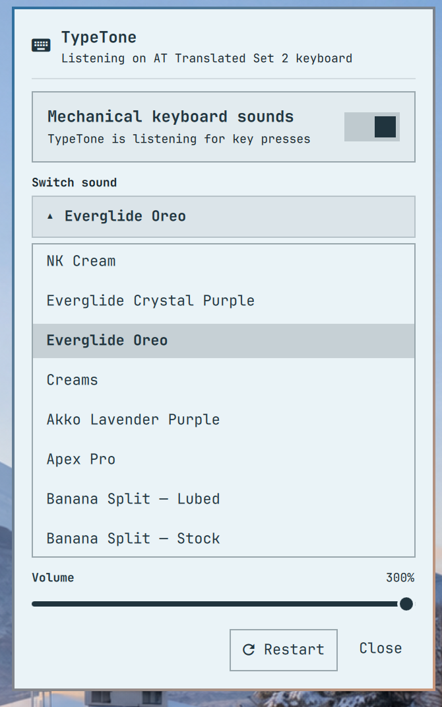

# TypeTone

Mechanical keyboard and mouse-click sounds for the Omarchy desktop, powered by
[Wayvibes](https://github.com/sahaj-b/wayvibes).

TypeTone is an Omarchy Quattro service and bar widget. It manages Wayvibes
processes, provides controls that match the Omarchy shell, and remembers the
preferred volume for each keyboard and mouse sound pack. TypeTone does not
synthesize keyboard audio itself: Wayvibes reads Linux input events and plays
audio samples. The bundled mouse clicks are processed from redistributable CC0
recordings and work offline.



## Features

- Global mechanical-keyboard sounds on Wayland through Wayvibes
- Left, right, middle, side, and extra mouse-button sounds
- Automatic mouse and touchpad detection with a device selector
- Six recorded mouse-click profiles: Clean, Soft, Deep, Razer, Logitech, and
  Studio
- Omarchy bar control with click-to-toggle and right-click settings
- Scrollable selector for 20 upstream sound packs
- Independent volume memory for every keyboard and mouse sound pack
- Live profile updates while dragging either volume control
- Mouse-wheel volume control from the bar
- Separate keyboard and mouse toggles, packs, devices, and volume profiles
- Icon-only bar control with a master mute that restores the previous toggles
- Guided one-command setup for Wayvibes, sound packs, permissions, and TypeTone
- Automatic compatibility repair for upstream packs with missing mapped samples
- One guarded keyboard process and one guarded mouse process after shell reloads
- Automatic Wayvibes process lifecycle and visible error/status feedback
- No network access or telemetry in the TypeTone plugin

## Requirements

- Omarchy Quattro with the plugin-capable Omarchy shell
- [Wayvibes](https://github.com/sahaj-b/wayvibes)
- A Wayvibes-compatible sound-pack collection at
  `~/.local/share/wayvibes/soundpacks`
- Permission to read the selected keyboard and pointing device through Linux
  `evdev`

Wayvibes and its keyboard sound packs are external dependencies. They are not
included in this repository and are not covered by TypeTone's license. The
bundled mouse recordings use CC0; see
[THIRD_PARTY_NOTICES.md](THIRD_PARTY_NOTICES.md).

Some upstream keyboard-pack configs reference sample filenames that are not
included in the pack. Before starting keyboard playback, TypeTone fills only
those missing filenames with relative symlinks to an existing short per-key
sample from the same pack. It does not rewrite the pack's config or audio.

## Install

### Guided setup

Paste this one command into an Omarchy terminal:

```bash
bash <(curl -fsSL https://raw.githubusercontent.com/phuclh/omarchy-typetone/main/install.sh)
```

The installer explains each action and asks before making changes. It installs
Wayvibes, grants input-device access, downloads the keyboard sound packs,
selects a detected keyboard, and installs TypeTone from GitHub. If it adds your
user to the `input` group, log out and back in once when it finishes.

Review [`install.sh`](install.sh) before running it. Omarchy plugins and this
installer run as unsandboxed user code.

### Manual setup

#### 1. Install Wayvibes

From an Omarchy terminal:

```bash
omarchy pkg aur add wayvibes-git
```

Your user must be in the `input` group so Wayvibes can read keyboard and mouse
events:

```bash
sudo usermod -aG input "$USER"
```

Log out and back in after changing group membership.

#### 2. Download the upstream sound packs

For a new installation, use a sparse clone so only the `soundpacks` directory
is checked out:

```bash
git clone --depth 1 --filter=blob:none --sparse \
  https://github.com/sahaj-b/wayvibes.git \
  "$HOME/.local/share/wayvibes"
git -C "$HOME/.local/share/wayvibes" sparse-checkout set soundpacks
```

If `~/.local/share/wayvibes` already exists, keep it and place compatible packs
inside its `soundpacks` directory instead of running the clone command.

#### 3. Select a keyboard once

Run Wayvibes interactively before enabling TypeTone:

```bash
wayvibes --device "$HOME/.local/share/wayvibes/soundpacks/nk-cream" -v 0
```

Choose the keyboard in the terminal, then press `Ctrl+C`. Wayvibes remembers
the selection. Users of `keyd` or another remapper should normally select its
virtual keyboard. TypeTone also supports an explicit `deviceName` override in
its settings file.

#### 4. Install TypeTone

```bash
omarchy plugin add https://github.com/phuclh/omarchy-typetone.git --enable
```

TypeTone appears on the right side of the Omarchy bar by default. Existing
installations keep mouse sounds disabled until they are turned on from the
Mouse tab.

## Use

- **Left-click TypeTone:** open sound, volume, status, and restart controls
- **Right-click TypeTone:** mute both sound sources or restore their previous
  keyboard/mouse combination
- **Mouse wheel over TypeTone:** adjust the current sound's volume
- **Keyboard tab:** choose a switch pack and its volume
- **Mouse tab:** enable mouse clicks, select a mouse or touchpad, choose a click
  style, and adjust its volume

Each keyboard or mouse pack starts with the current volume the first time it is
selected. After you adjust it once, TypeTone restores that pack's own level
whenever you return to it.

## Mouse-click sounds

Wayvibes officially targets keyboards, but its audio loop can map any Linux
`EV_KEY` button code to a sample. TypeTone runs a second isolated Wayvibes
process for the selected pointing device and maps the standard left, right,
middle, side, and extra button codes. Keyboard behavior and Wayvibes' saved
keyboard selection remain independent.

TypeTone includes six profiles built from real mouse recordings: Clean, Soft,
Deep, Razer, Logitech, and Studio. Clean, Soft, and Deep retain the old
internal pack IDs so existing per-pack volume preferences continue to work
after upgrading from 1.1.

The processed WAV files are reproducible with
[`tools/generate-mouse-sounds.sh`](tools/generate-mouse-sounds.sh). `ffmpeg` is
needed only to regenerate them, not to use TypeTone. Source recordings,
authors, checksums, and license links are documented in
[`third_party/mouse-sounds/README.md`](third_party/mouse-sounds/README.md).

## Configuration

TypeTone stores user settings at:

```text
~/.config/wayvibes/omarchy.json
```

The `packVolumes` and `mousePackVolumes` objects contain the remembered levels
for keyboard and mouse packs. The top-level `volume` and `mouseVolume` values
are the current selections. An empty `deviceName` uses the keyboard selected
by Wayvibes; set it to an exact evdev device name to override that selection.
TypeTone resolves `mouseDeviceName` to its current `/dev/input/event*` path on
every scan, so normal event-number changes do not invalidate the selection.
The `resumeKeyboardEnabled` and `resumeMouseEnabled` values remember which
sources a right-click should restore after master mute.

Service status is available over Omarchy shell IPC:

```bash
omarchy-shell typetone status
```

## Update

```bash
omarchy plugin update io.github.phuclh.typetone --yes
```

## Remove

```bash
omarchy plugin remove io.github.phuclh.typetone
```

Removing TypeTone does not delete Wayvibes, downloaded sound packs, or
`~/.config/wayvibes/omarchy.json`. It also leaves any small compatibility
symlinks created for missing upstream samples. Remove those separately only if
no other application uses them.

## Security and privacy

Omarchy plugins run as unsandboxed user code. TypeTone starts and stops the
`wayvibes` executable, reads Linux keyboard and pointing-device events, writes
its settings plus an isolated Wayvibes mouse-device selection, and may add
relative symlinks for missing mapped samples inside the selected keyboard
sound pack. It also replaces an earlier TypeTone-managed Wayvibes process if
one survives a shell reload. It does not make network requests. Wayvibes
requires global access to input events via `evdev`; do not run it as root.
Review the Wayvibes source and use only sound packs you trust.

TypeTone does not store typed text, pointer movement, clicks, or input-event
history. It reacts to process status and delegates input-event handling and
audio playback to Wayvibes.

## Credits and license

Created by [Phuc Le (@phuclh93)](https://x.com/phuclh93).

TypeTone is built on top of
[Wayvibes by sahaj-b](https://github.com/sahaj-b/wayvibes), which provides the
keyboard-event and audio engine. TypeTone provides the Omarchy integration,
controls, mouse-device adapter, processed mouse packs, persistence, and
per-pack volume profiles.

TypeTone's original source code and documentation are released under the
[MIT License](LICENSE). External software and bundled CC0 sound recordings
remain under their respective authors' terms.
